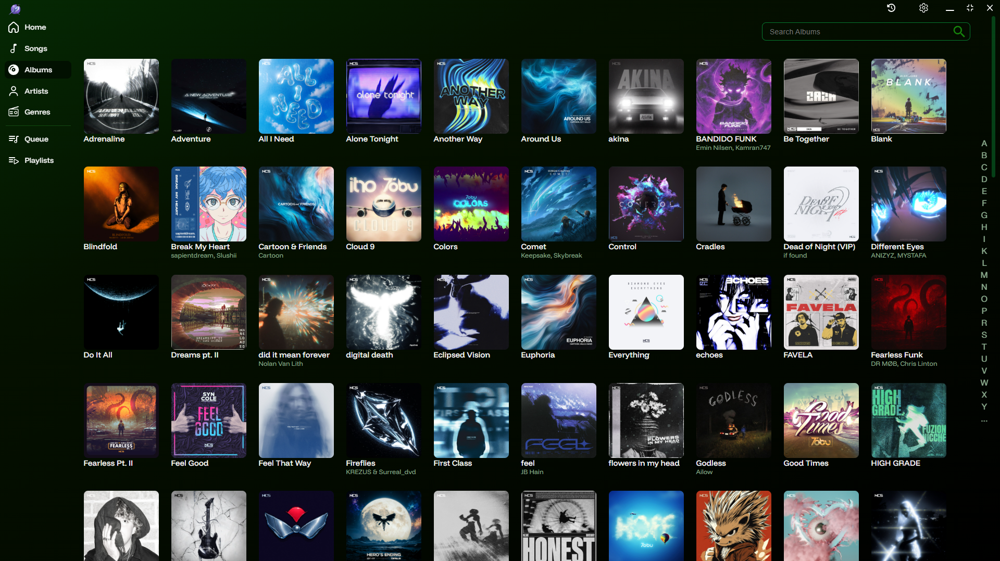
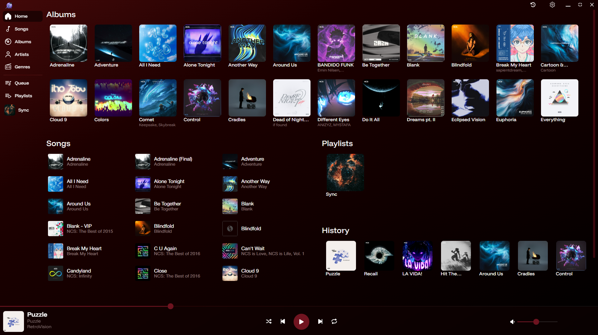
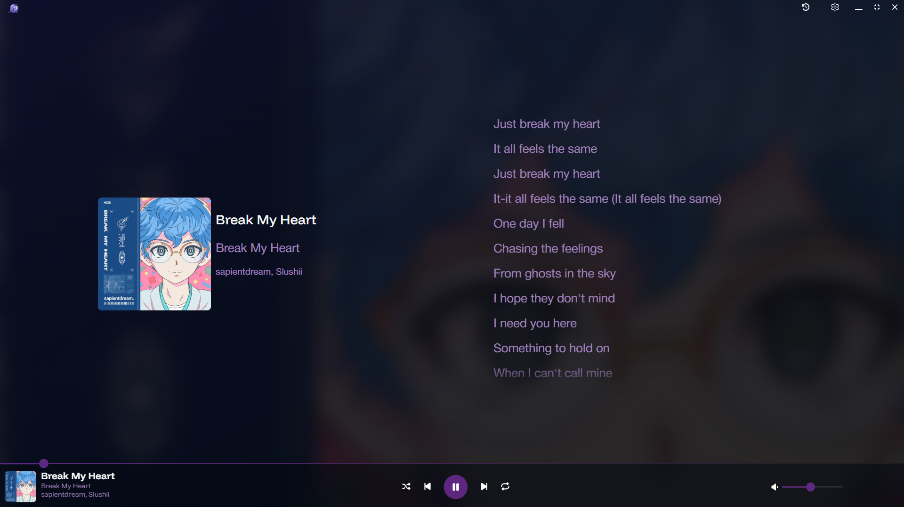

    
 

# Robintuk

A beautiful and colorful music player for **Windows**.

## Download

- **Recommended:** Download and install the latest installer from [Github Releases](https://github.com/VulshokBersrker/robintuk_player/releases/latest).

## Main Features

- Play most music formats (mp3 at the moment)
- Smooth performance even with 11,000 songs loaded
- Add custom playlist artwork
- Customize the look with multiple theme colors

## [Screenshots](./assets/index.md)

More: [See all screenshots](./assets/screenshots/index.md)

---

## Development

Discovered a bug? Please open an [ISSUE](https://github.com/VulshokBersrker/robintuk_player/issues) to get it fixed.
Made with Tauri (React and Rust).

## Features to Be Added

- [ ] Get artist data from online service for artist page (maybe)
- [ ] Playlist Import/Export as m3u file
- [ ] Remove a song from the queue
- [ ] Notification of version update
- [ ] Song details screen
- [ ] Smoother music progress bar
- [ ] Remove HTML selection ability
- [ ] Custom context menu when hovering on songs/albums
- [ ] Installer Wizard
- [ ] Open with (in file explorer)
- [ ] Search (on songs, albums, and artists pages)
- [ ] Mini Player
- [ ] Remember last 100 played songs/albums
- [ ] Custom Home/Welcome screen
- [ ] Shuffle Controls
- [ ] Display the queue
- [ ] New default playlist icons
- [ ] New default image for missing album artwork
- [ ] Remember scroll position on page back
- [ ] Force scrollbar to stop before music control section
- [ ] Update Play/Pause icon design
- [ ] Support for flac and wav
- [ ] Improve sidebar active navigation styles
- [ ] Lock navigation when scanning for new music from settings?
- [x] Reorganize Albums page
- [x] Repeat Controls
- [x] Volume Controls
- [x] Keyboard Media Controls
- [x] Organize albums by track number and disc number

## Known Issues

- [ ] Songs end one second early sometimes
- [ ] Songs have hiccups randomly (maybe due to refreshes in dev mode)
- [ ] CSS Optimization
- [ ] Application Optimizations (streamlining, data caching, etc.)
- [ ] Playback errors
- [ ] Protections on adding child directories to scan music
- [ ] Better error handling
- [ ] Albums displaying Disc 0 when metadata has no disc value
- [ ] Blank pages on route change while it grabs the data from the backend
- [ ] Fix songs page search results formatting
- [x] Wrong icon shown when resizing window with double click or drag