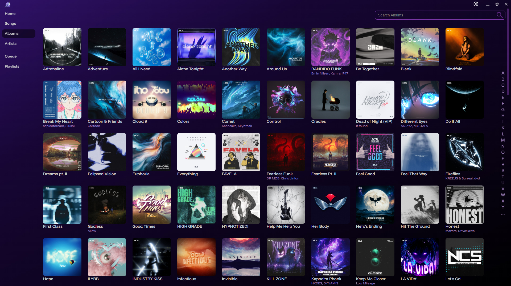
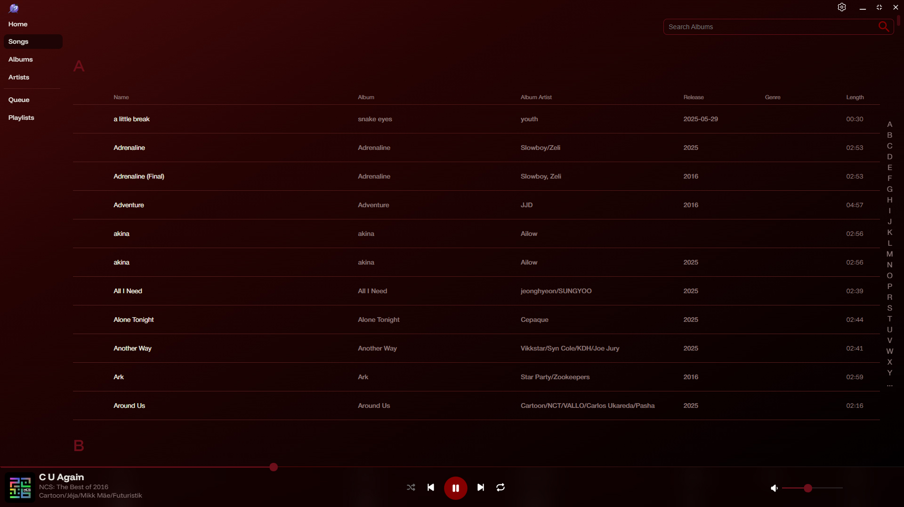

    
     

### A beautiful and colorful music player for **Windows**.

)  

## Download

- **Recommended:** Download and install the latest installer from [Github Releases](https://github.com/VulshokBersrker/robintuk_player/releases/latest).
- Old versions may have crashes/issues that have been fixed in the latest release.

## Main Features

- Play most music formats (mp3, flac, ogg, aiff, m4a)
- Great performance even with 10,000+ songs loaded
- Custom playlist artwork (including animated images)
- Customize the look with multiple color themes
- View last 100 played songs
- Search to find your music faster
- Fast scans to add your music quickly (~5000 songs scanned per minute)
- Backup and Restore your music database and images
- Use mp3 files to import playlists from other apps or export your playlists for save keepings

## [Screenshots](./assets/screenshots/index.md)

More: [See all screenshots](./assets/screenshots/index.md)

---

## Development

Discovered a bug? Please open an [ISSUE](https://github.com/VulshokBersrker/robintuk_player/issues) to get it fixed.
Made with Tauri (React and Rust).

If you'd like to contribute to the project, please let me know in [DISCUSSIONS](https://github.com/VulshokBersrker/robintuk/discussions).

## To Do Features

- [ ] Linux support
- [ ] Smoother music progress bar
- [ ] Second Shuffle mode (Reshuffled at the end of current queue)
- [ ] Gapless playback
- [ ] Add support for wav
- [ ] Update queue page when playlist is changed
- [ ] Drag and Drop playlist order
- [ ] Get artist data from online service for artist page (Not great options once you have more than 100 songs)
- [x] Playlist Import/Export as m3u file
- [ ] Notification of version update
- [ ] Place sink into another thread? to prevent stutters when there is heavy system load
- [ ] Open with (in file explorer)
- [ ] CSS Updates when window size changes
- [ ] Create placeholder templates while pages are loading
- [x] History section should update everytime new songs are played
- [x] Update to color themes
- [x] Improved Context Menu
- [x] Auto-Remove album/playlist artwork when respective songs are removed
- [x] Display song details through context menu
- [x] Custom icon for installer
- [x] Installer Wizard
- [x] Custom context menu when right clicking on songs/albums
- [x] Playlist functions (create, add, delete, rename, reorder)
- [x] Queue page functions (clear, add to)
- [x] Lock scan even when you leave the settings page
- [x] Add support for flac
- [x] Force scrollbar to stop before music control section
- [x] Remember last 100 played songs/albums
- [x] Home/Welcome screen
- [x] Search (on songs, albums, and artists pages)
- [x] Shuffle Controls
- [x] Display the queue
- [x] Update Play/Pause icon design
- [x] Improve sidebar active navigation styles
- [x] Remove HTML selection ability
- [x] Reorganize Albums page
- [x] Repeat Controls
- [x] Volume Controls
- [x] Keyboard Media Controls
- [x] Organize albums by track number and disc number

## Known Issues

- [ ] Remember scroll position on page change (not possible with dynamically loaded content to my knowledge)
- [ ] When changing audio device, it will continue to play sound to the old device (only fix is to restart the app, current limitation of cpal)
- [x] Scan has a chance to fail with new tag system
- [ ] Songs have hiccups randomly (maybe due to heavy system load from other programs)
- [ ] Application Optimizations (streamlining, data caching, etc.)
- [ ] Better error handling
- [x] Sections on songs/albums/artists pages not hiding certain parts ( Z, ... sections appear sometimes when nothing has those values)
- [x] If scan breaks or user closes app while scanning, scan buttons will be disabled because it thinks a scan is still ongoing
- [x] Blank pages on route change while it grabs the data from the backend (fixed?)
- [x] Selecting songs/albums and using the search bar will break the selection
- [x] Cancelling changing playlist cover art will remove any current artwork until the page is reloaded
- [x] Doubles on some songs in history
- [x] Add music to playlist not working on home, album overview, ,songs, or artist overview pages with "Add To" or context menu
- [x] Fix songs page search results formatting
- [x] Albums displaying Disc 0 when metadata has no disc value
- [x] Protections on adding child directories to scan music
- [x] Songs end one second early sometimes
- [x] Wrong icon shown when resizing window with double click or drag