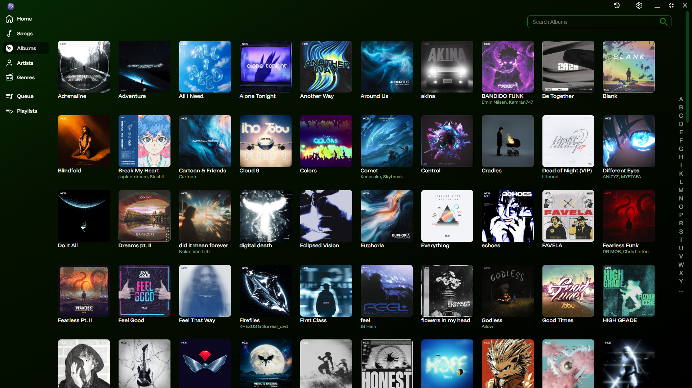
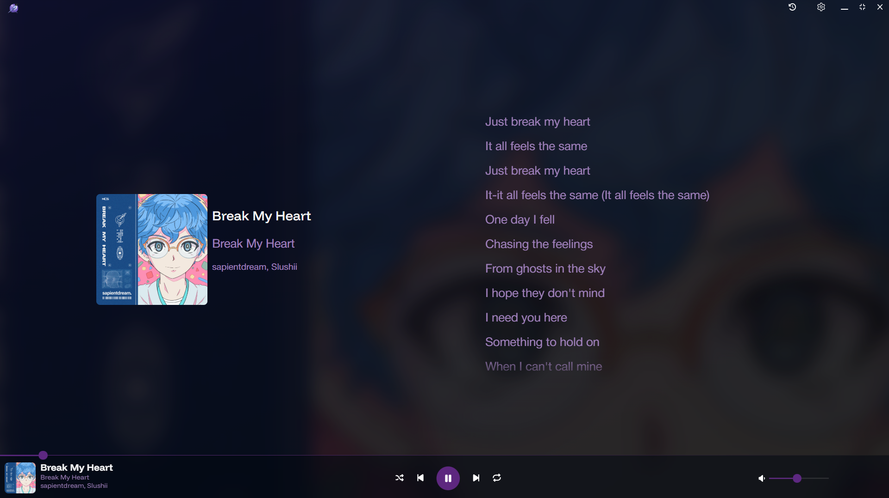
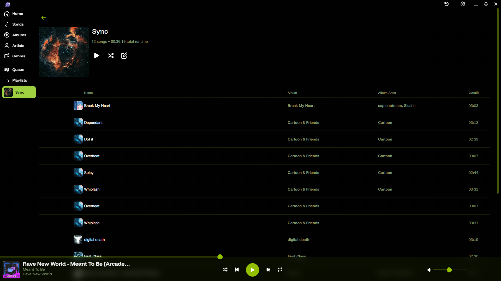

    
     

### A beautiful and colorful music player for **Windows**.

 

## Download

- **Recommended:** Download and install the latest installer from [Github Releases](https://github.com/VulshokBersrker/robintuk_player/releases/latest).
- Old versions may have crashes/issues that have been fixed in the latest release.

## Main Features

- Play most music formats (mp3, flac, ogg, aiff, m4a, wav)
- Great performance with 10,000+ songs loaded
- Custom playlist artwork (including animated images)
- Drag and Drop Playlist order
- Customize the look with multiple color themes
- Last 100 songs played history
- Search to find your music faster
- Fast scans to add your music quickly (~5000 songs per minute)
- Backup, Restore, or Reset your music database and images
- Use m3u/m3u8 files to import playlists from other apps or export your playlists for safe keeping
- Download song lyrics using LRCLIB

## [Screenshots](./assets/screenshots/index.md)

More: [See all screenshots](./assets/screenshots/index.md)

---

## Development

Discovered a bug? Please open an [ISSUE](https://github.com/VulshokBersrker/robintuk_player/issues) to get it fixed.
Made with Tauri (React and Rust).

If you'd like to contribute to the project, please let me know in [DISCUSSIONS](https://github.com/VulshokBersrker/robintuk/discussions).

## To Do Features

- [ ] Place sink into another thread? to prevent stutters when there is heavy system load
- [ ] Open with (in file explorer)
- [ ] Better DPI aware CSS
- [x] Drag and Drop playlist order
- [x] Improve Event logger for debugging
- [x] Gapless playback
- [x] Get and display Lyrics for songs using LRCLIB

## Far Out Features

- [ ] Equalizer
- [ ] Linux support
- [ ] Get artist data from online service for artist page (No great options once you have more than 100 songs)

## Known Issues

- [ ] Error on start sometimes where the wrong queue is saved or removed
- [ ] Some album artwork is not deleted when songs are removed
- [ ] Some albums with multiple discs are disorganized on view (Due to disorganized metadata)
- [ ] Songs have hiccups randomly (due to heavy system load from other programs)

## Dependency Issues

- [ ] When changing audio device, it will continue to play on old device (only fix is to restart the app, issue with rodio)